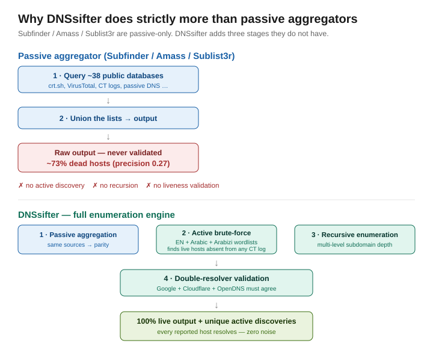
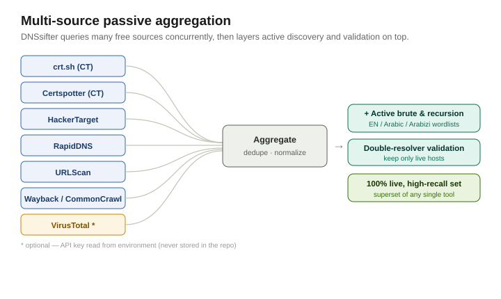
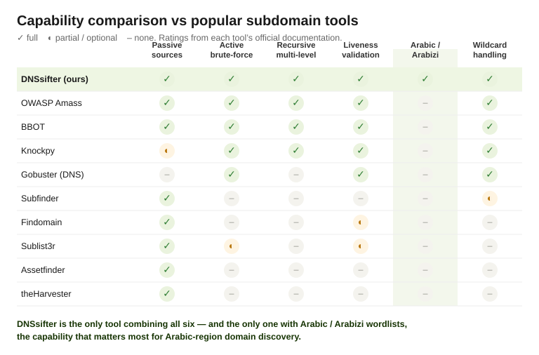
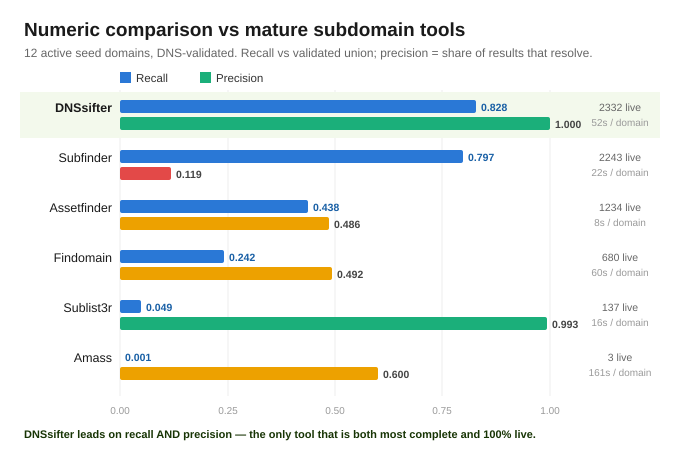
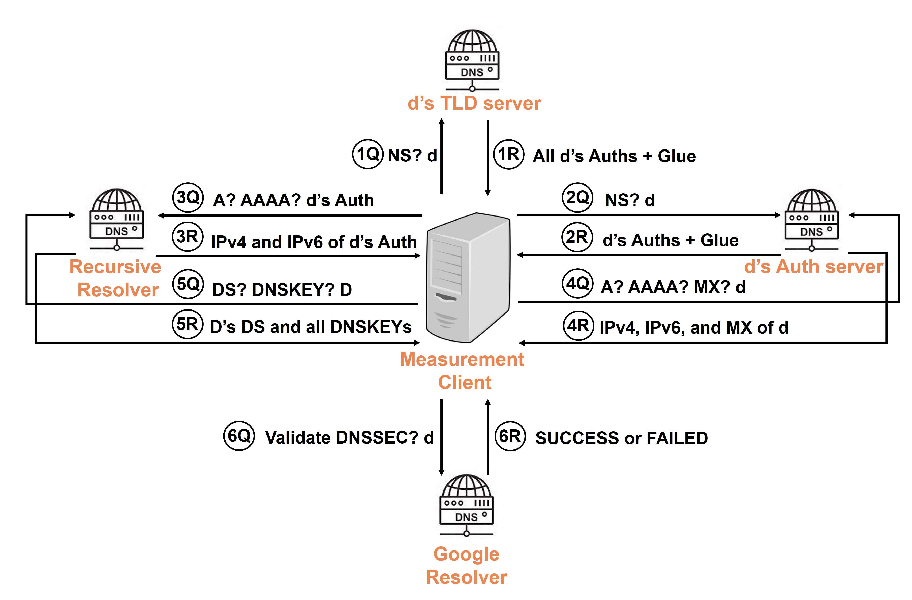
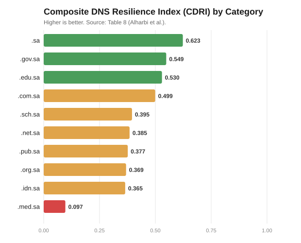

# DNSsifter

DNSsifter is an automated multithreaded bruteforcer to discover seed domain names, subdomain names, and hostnames by systematically generating and querying a large number of possible combinations against targeted DNS servers. Since a d can have multiple levels of subdomains, DNSsifter enumerates deeply on all subdomain levels staring from the seed level until it reaches the last level subdomain. For instance, `test3.test2.test1.example.com` has three levels of subdomains. A subdomain may comprise up to 255 characters, counting the dots. However, if the subdomain contains multiple levels, each level can only consist of a maximum of 63 characters. 


DNSsifter is a high-performance, asynchronous tool built for DNS brute-forcing and fuzzing. Designed with speed and simplicity in mind, it caters to penetration testers, ethical hackers, and cybersecurity professionals focused on active reconnaissance. It aids in uncovering hidden subdomains and detecting potential vulnerabilities within a target's DNS infrastructure.

---

## Table of Contents

- [How DNSsifter Works](#how-dnssifter-works)
- [How DNSsifter Compares](#how-dnssifter-compares)
- [Features](#features)
- [Installation](#installation)
- [Usage](#usage)
  - [1. Convert English Wordlist to Arabic](#1-convert-english-wordlist-to-arabic)
  - [2. Convert Arabic Wordlist to ASCII](#2-convert-arabic-wordlist-to-ascii)
  - [3. Convert Arabic Wordlist to English Phonetics](#3-convert-arabic-wordlist-to-english-phonetics)
  - [4. DNS Vulnerability Scanner](#4-dns-vulnerability-scanner)
  - [5. DNS Enumeration](#5-dns-enumeration)
  - [6. DNS Explorer (Measurements)](#6-dns-explorer-measurements)
  - [7. CDRI Scoring](#7-cdri-scoring)
  - [8. Benchmarking vs Other Tools](#8-benchmarking-vs-other-tools)
- [Reproducibility](#reproducibility)
- [Data Availability](#data-availability)
- [Directory Structure](#directory-structure)
- [Citation](#citation)
- [Contributing](#contributing)

---

## How DNSsifter Works

Mature subdomain tools such as **Subfinder**, **Amass**, and **Sublist3r** are
*passive aggregators*: they query a large set of third-party databases (Certificate
Transparency logs, passive DNS, scanners) and return the union of the results. They
do **not** perform active discovery, recursion, or liveness validation — by design
you are expected to pipe their raw output into a separate resolver. As a result, a
large fraction of what they report no longer resolves.

DNSsifter is a **full enumeration engine**. It matches those tools on passive
breadth and then adds three stages they do not have — active brute-force with
multilingual wordlists, recursive multi-level enumeration, and trusted-resolver
validation — so every reported host is verified live.



### Passive source aggregation

The passive stage ([`Scripts/passive_sources.py`](Scripts/passive_sources.py))
queries many free, no-key sources concurrently and merges them: **crt.sh**
(with retry + `exclude=expired` fallback for very large domains), **Certspotter**
(paginated), **HackerTarget**, **RapidDNS**, **URLScan**, **Wayback/CommonCrawl**,
and others. High-quality keyed sources (e.g. **VirusTotal**) are optional and are
read from environment variables only — **never stored in the repository**:

```bash
export VT_API_KEY=...           # optional, lifts recall on large domains
export CERTSPOTTER_API_KEY=...  # optional, removes the anonymous result cap
```



### Why this matters

The discovered candidates from *every* stage are re-resolved through a set of
trusted recursive resolvers (Google, Cloudflare, OpenDNS) that must agree before a
host is kept. This yields a result set that is a **superset of any single passive
tool** while remaining **100% live** — no manual resolving or noise filtering
needed afterwards.

---

## How DNSsifter Compares

Most popular tools occupy a single niche: **Subfinder, Findomain, Assetfinder, and
theHarvester** are passive-only; **Gobuster** is brute-force-only; **Amass, BBOT, and
Knockpy** combine several techniques. DNSsifter is the **only** tool that combines all
six capabilities below — and the only one shipping **Arabic / Arabizi wordlists**, the
single most relevant capability for discovering Arabic-region domains.



### Numeric benchmark

On a stratified sample of 12 active Saudi seed domains (Riyadh vantage), every
candidate from every tool is re-resolved through trusted resolvers (Google,
Cloudflare, OpenDNS); the validated union (2,815 live hosts) is the ground truth.
DNSsifter leads on **both recall and precision** — it is the only tool that is at
once the most complete *and* 100% live:

| Tool | Reported | Validated | Recall | Precision | Runtime/domain | Depth | Unique live |
|------|---------:|----------:|-------:|----------:|---------------:|------:|------------:|
| **DNSsifter** | 2,332 | **2,332** | **0.828** | **1.000** | 52 s | 6 | 362 |
| Subfinder | 18,842 | 2,243 | 0.797 | 0.119 | 22 s | 6 | 458 |
| Assetfinder | 2,537 | 1,234 | 0.438 | 0.486 | 8 s | 6 | 3 |
| Findomain | 1,382 | 680 | 0.242 | 0.492 | 60 s | 5 | 0 |
| Sublist3r | 138 | 137 | 0.049 | 0.993 | 16 s | 2 | 1 |
| Amass¹ | 5 | 3 | 0.001 | 0.600 | 161 s | 0 | 0 |

¹ Amass v5 requires a datasource configuration file (API keys) and stores results in
a graph database rather than standard output; run with no configuration it returns
almost nothing. The row reflects out-of-the-box behaviour.



Subfinder reports the most names (18,842) but **88% of them no longer resolve**
(precision 0.119); DNSsifter reports only verified-live hosts (precision 1.000) and
still achieves the **highest recall**, because its active brute-force and recursion
discover live hosts that exist in no passive database. The data and figure regenerate
with `python3 Scripts/plot_tool_benchmark.py` from
[`Data/tool_benchmark.csv`](Data/tool_benchmark.csv).

> All values are aggregate, method-level metrics. To reproduce them on your own
> targets see [Benchmarking vs Other Tools](#8-benchmarking-vs-other-tools).
> **No target domains or discovered host data are published in this repository.**

---

## Features


### 1. Wordlist Generation:
Creates customized wordlists in English, Arabic, and Arabizi.
#### What we do here:
DNSsifter utilizes curated wordlists—collections of commonly used domain-related terms—for generating potential seed domains and subdomains during active enumeration and reconnaissance. These wordlists include general vocabulary, industry-specific keywords, brand names, and popular phrases that are likely to appear in real-world domain names. They are essential for security researchers, penetration testers, and administrators in evaluating the exposure of DNS infrastructure.

To make the domain identification process more comprehensive and inclusive of regional variations, we developed specialized scripts to create wordlists aligned with Arabic-speaking regions. Specifically, DNSsifter includes instrumented scripts to:

1. **Translate** commonly used English words and technical terms into Arabic to reflect linguistic relevance in domain names.
2. **Generate Arabizi wordlists**—transliterated Arabic written using Latin characters, often used informally online.
3. **Create ASCII-compatible versions** of Arabic domain-related terms to support DNS environments that require ASCII-only inputs.

These multilingual wordlists expand the effectiveness of DNS brute-forcing and enhance the discovery of culturally and linguistically relevant domain assets.


### 2. DNS Enumeration:
Actively discovers hidden seed domains and subdomains through asynchronous brute-forcing techniques. 
#### What we do here:
At each level, DNSsifter requires three input lists for each Top-Level Domain (TLD) or Second-Level Domain (SLD) for enumeration:

1. A list of all domain names registered with the target TLD/SLD, acquired through passive DNS enumeration. This list contains either the set of seed domains or the i-th level subdomains for each seed domain.
2. A list consisting of publicly accessible seed domains or subdomains registered with the target TLD/SLD.
3. A list obtained by performing active DNS enumeration where the wordlists are prepended to the target TLD/SLD.  
   - For example, if the target SLD is `.com.sa` and the wordlist contains `site1`, `site2`, and `site3`, DNSsifter generates:  
     - `site1.com.sa`  
     - `site2.com.sa`  
     - `site3.com.sa`

Next, DNSsifter performs DNS resolution in search of active seed domains or subdomains. To reduce false positives, DNSsifter re-runs the resolution process on the collected results using trusted resolvers like:

- Google DNS: `8.8.8.8`, `8.8.4.4`  
- OpenDNS: `208.67.222.222`, `208.67.220.220`  
- Cloudflare DNS: `1.1.1.1`

This double-resolution step helps eliminate invalid or poisoned records. The final output is a list of confirmed active domains and subdomains, which then serves as input for the next enumeration level. DNSsifter continues recursively until reaching a level with no active subdomains — marking the end of enumeration.


### 3. DNS Measurments:
Performs DNS configuration and performance analysis for security insights.



#### What we do here:
After identifying DNS seed domains and subdomains, DNSsifter conducts a series of DNS measurements to assess configuration quality, security posture, and infrastructure resilience. For each domain in the seed set, the tool performs the following steps:

- **Step 1: Querying Name Servers**  
  DNSsifter queries both the parent and child authoritative name servers to determine the authoritative NS set for each domain.

- **Step 2: Collecting IP Addresses**  
  The tool retrieves IPv4 (`A`) and IPv6 (`AAAA`) records for each nameserver. It detects round-robin configurations where one NS returns multiple IPs to balance traffic and enhance redundancy.

- **Step 3: Testing Configuration**  
  DNSsifter sends:
  - `A` and `AAAA` queries to validate nameserver configuration and detect lame delegations.
  - `MX` queries to retrieve mail exchanger records for the domain.

- **Step 4: Verifying MX Server Configuration**  
  The tool queries the `A` records of MX servers to verify their nameserver configurations and check for misconfigurations.

- **Step 5: DNSSEC Testing**  
  DNSsifter checks for DNSSEC deployment by retrieving `DS` and `DNSKEY` records. It then validates them using trusted resolvers like Google’s `8.8.8.8` to confirm the authenticity and integrity of the domain’s DNS data.

- **Step 6: Robustness & Redundancy Evaluation**  
  The tool evaluates DNS robustness using:
  - MaxMind’s GeoIP2 ASN database to identify the number of unique /24 prefixes and ASNs associated with the nameserver IPs.
  - iGreedy-based RTT measurements via 500 globally distributed RIPE Atlas probes to detect IP anycast adoption and validate infrastructure diversity.

 
### 4. DNS Vulnerability Assessment:
Scans for critical DNS security vulnerabilities and misconfigurations.

#### What we do here:
DNSsifter includes an automated script designed to perform a comprehensive evaluation of common DNS vulnerabilities. This feature helps identify both active and passive threats, as well as misconfigurations that may expose DNS infrastructure to exploitation or service disruption.

The tool scans for five key DNS security issues, categorized by their activity type (active vs. passive) and their impact level. This allows users to understand the nature of each issue—whether it’s a direct security vulnerability or a configuration oversight—and prioritize mitigation accordingly.

The following table summarizes the vulnerabilities DNSsifter checks for:

| **Vulnerability**                  | **Activity Type** | **Security Impact**                        |
|-----------------------------------|-------------------|--------------------------------------------|
| AXFR Zone Transfer                | Active            | High (Serious misconfiguration)            |
| DNS Cache Poisoning               | Passive           | High (Exploitable in weak DNS servers)     |
| Subdomain Takeover (Wildcard DNS) | Passive           | High (If misconfigured)                    |
| NXDOMAIN Flooding (DNS Amplification) | Active        | Moderate (Used in DDoS attacks)           |
| Stale NS Record Detection         | Passive           | High (If NS records are hijackable)        |


---

## Installation

### Prerequisites

- Python 3.x
- Bash (for the shell-based vulnerability scanner) and `dig`/`delv` (bind-utils)
- Required Python packages:
  ```bash
  pip install -r requirements.txt
  # (requests, dnspython, geoip2, tqdm, colorama)
  ```
- For the live benchmark: `amass`, `subfinder`, `sublist3r` on `PATH` (optional)
- MaxMind GeoIP databases (place in `Scripts/Measurements/data/` directory):
  - GeoLite2-City.mmdb
  - GeoLite2-Country.mmdb
  - GeoLite2-ASN.mmdb

### Setup

1. Clone the repository:
   ```bash
   git clone https://github.com/hmoud1416/DNSsifter.git
   cd DNSsifter
   ```

2. Install dependencies:
   ```bash
   pip install -r requirements.txt
   ```

3. Make scripts executable:
   ```bash
   chmod +x Scripts/*.sh
   ```

---

## Usage

### 1. Convert English Wordlist to Arabic

This script converts Arabic words to their ASCII-compatible Punycode representation.

#### Command:
```bash
python3 Scripts/translate_word_to_arabic.py [-h] -l WORDLIST -o OUTPUT [-k APIKEY]
```

### 2. Convert Arabic Wordlist to ASCII

This script converts Arabic words to their ASCII-compatible Punycode representation.

#### Command:
```bash
python3 Scripts/Convert_ArabicWordlist_To_Ascii.py -l input_arabic.txt -o output_ascii.txt
```

#### Arguments:
- `-l/--list`: Path to the input file containing Arabic words (one per line).
- `-o/--output`: Path to the output file to save the Punycode results.

#### Example:
Input (`input_arabic.txt`):
```
فاطمة
حمود
أحمد
```

Output (`output_ascii.txt`):
```
xn--mgbe5bybw
xn--sgbe9dm
xn--igbug1g
```

---

### 3. Convert Arabic Wordlist to English Phonetics

This script translates Arabic words into multiple possible English phonetic representations.

#### Command:
```bash
python3 Scripts/Convert_ArabicWordlist_To_EnglishPhonetics.py -l input_arabic.txt -o output_phonetics.txt
```

#### Arguments:
- `-l/--list`: Path to the input file containing Arabic words.
- `-o/--output`: Path to the output file to save unique phonetic words.

#### Example:
Input (`input_arabic.txt`):
```
فاطمة
حمود
أحمد
```

Output (`output_phonetics.txt`):
```
Fatima
Hamoud
Ahmed
```

---

### 4. DNS Vulnerability Scanner

This script scans domains for common DNS vulnerabilities.

#### Command:
```bash
./Scripts/DNS_Vulnerability_Scanner.sh -d domains.txt -o results.json
```

#### Arguments:
- `-d/--domains`: Path to the input file containing domains (one per line).
- `-o/--output`: Path to the output file to save scan results.

#### Example:
Input (`domains.txt`):
```
example.com
google.com
```

Output (`results.json`):
```json
[
    {
        "domain": "example.com",
        "vulnerabilities": [
            {"vulnerability": "AXFR Open Zone Transfer", "server": "ns1.example.com"}
        ]
    }
]
```

---

### 5. DNS Enumeration

Multithreaded, recursive DNS enumeration with wildcard control and trusted-resolver
confirmation. It combines **multi-source passive discovery**
([`Scripts/passive_sources.py`](Scripts/passive_sources.py)) with active
brute-forcing of a wordlist, enumerating level-by-level until no new active names are
found, and validates every candidate through the trusted resolver set. See
[How DNSsifter Works](#how-dnssifter-works) for the architecture and
[REPRODUCIBILITY.md](REPRODUCIBILITY.md) for the exact measurement configuration.

#### Command:
```bash
python3 Scripts/DNSsifter-emumerate.py -d DOMAIN -w WORDLIST [-o OUTPUT]
```

#### Key parameters (paper defaults):
| Flag | Default | Meaning |
|------|---------|---------|
| `--rate` | `10` | Max DNS queries per second per seed domain |
| `--wildcard-cap` | `1000` | Max probes for a wildcard-enabled domain |
| `--threads` | `20` | Concurrent resolution workers |
| `--max-depth` | `5` | Maximum subdomain recursion depth |
| `--timeout` | `5` | Per-query DNS timeout (seconds) |
| `--resolvers` | Google/Cloudflare/OpenDNS | Trusted confirmation resolvers |
| `--insecure` | off | Skip TLS verification for passive sources (only if the local Python CA bundle is stale; results are re-validated via DNS regardless) |
| `--deep-passive` | off | Also brute-force every live passive name (deeper, slower) |

#### Example:
```bash
python3 Scripts/DNSsifter-emumerate.py -d example.com \
    -w Wordlists/English_Wordlist_Subdomain.txt \
    --rate 10 --wildcard-cap 1000 --max-depth 5 \
    -o results/example_subdomains.txt
```


### 6. DNS Explorer (Measurements)

The `Measurements` folder contains a comprehensive DNS analysis tool.

#### Directory Structure:
```
Measurements/
├── dns_explorer/
│   ├── __init__.py                     # Package initialization
│   ├── dns_utils.py                    # Main DNS utility functions
│   ├── geoip_utils.py                  # GeoIP lookup utilities
│   ├── main.py                         # Entry point for DNS Explorer
│   ├── output_utils.py                 # Output handling utilities
│   └── tests/                          # Unit tests
├── setup.py                            # Setup script for installation
```

##### **dns_utils.py**
- Contains core functions for DNS analysis:
  - Fetches NS, A, AAAA, and MX records.
  - Performs GeoIP lookups using MaxMind databases.
  - Validates DNSSEC configurations.
  - Supports concurrent domain processing with progress tracking.

##### **geoip_utils.py**
- Provides utilities for GeoIP lookups:
  - Uses MaxMind GeoLite2 databases for city, country, and ASN lookups.
  - Handles invalid IP addresses gracefully.

##### **main.py**
- Entry point for the DNS Explorer tool:
  - Accepts a list of domains as input.
  - Processes domains concurrently if threading is enabled.

##### **setup.py**
- Installation script for the DNS Explorer tool:
  - Installs required dependencies (`geoip2`, `argparse`).
  - Creates a command-line tool alias (`dnsexplorer`).

##### **tests/**
- Contains unit tests for DNS and GeoIP utilities.

#### Installation:
To install the DNS Explorer tool:
```bash
cd Scripts/Measurements
pip install .
```

#### Usage:
```bash
dnsexplorer --domains example.com google.com --threads
```

#### Features:
- Fetches NS, A, AAAA, and MX records.
- Performs GeoIP lookups.
- Validates DNSSEC configurations.
- Saves results in JSON format.

---

### 7. CDRI Scoring

Reproduces the **Composite DNS Resilience Index (CDRI)** — the weighted additive
index over the seven resilience dimensions. The script ships with the aggregated,
anonymized dimension scores for every SLD/ccTLD and reproduces the published ranking
exactly. It also includes a Monte-Carlo **weight-sensitivity analysis** to
demonstrate the robustness of the sector ranking under alternative weight sets.

Depends only on the Python standard library. Full equations and variable
definitions are in [REPRODUCIBILITY.md](REPRODUCIBILITY.md).

#### Command:
```bash
# Reproduce the published CDRI ranking (.sa = 0.623 ... .med.sa = 0.097)
python3 Scripts/cdri_score.py --input Data/cdri_dimension_scores.csv

# Weight-sensitivity / robustness analysis
python3 Scripts/cdri_score.py --input Data/cdri_dimension_scores.csv \
        --sensitivity --trials 10000 --jitter 0.05
```

Default weights (sum to 1.0): `w1=0.20` (NS redundancy/diversity), `w2=0.15`
(delegation correctness), `w3=0.10` (provider dependency), `w4=0.15`
(parent–child consistency), `w5=0.10` (Anycast), `w6=0.20` (DNSSEC health),
`w7=0.10` (caching).

The figure below is generated directly from the released data with
`python3 Scripts/plot_cdri.py` (dependency-free, renders on GitHub):



---

### 8. Benchmarking vs Other Tools

Compares DNSsifter against mature enumeration tools (**Amass, Subfinder, Sublist3r**)
on the same seed domain, reporting **recall, precision, runtime, depth, and unique
discoveries** against a validated ground-truth set. Candidate names are re-resolved
through the trusted resolver set so the comparison is consistent across tools. See
[How DNSsifter Compares](#how-dnssifter-compares) for the aggregate results. The
harness writes results locally only — **no target domains or discovered hosts are
committed to this repository** (the `domains/` and `results/` paths are gitignored).

#### Command:
```bash
# Live benchmark (requires amass/subfinder/sublist3r on PATH)
python3 Scripts/benchmark_enumeration.py \
    --domain example.com \
    --wordlist Wordlists/English_Wordlist_Subdomain.txt \
    --out results/benchmark_example.json

# Score pre-collected outputs offline (no re-run)
python3 Scripts/benchmark_enumeration.py --score-only --validate \
    --result DNSsifter=out/dnssifter.txt --result Amass=out/amass.txt \
    --result Subfinder=out/subfinder.txt --result Sublist3r=out/sublist3r.txt \
    --out results/benchmark_example.json
```

---

## Reproducibility

The full reproducibility appendix — exact query schedule, measurement dates,
resolvers, filtering thresholds, wildcard handling rules, DNSsifter parameters, and
**all metric/CDRI equations with complete variable definitions** — is documented in:

➡️ **[REPRODUCIBILITY.md](REPRODUCIBILITY.md)**

Highlights:
- Active measurement campaign: **2024-09-04 to 2024-12-30**, multiple rounds averaged.
- Single vantage point (Riyadh) and single validating resolver (`8.8.8.8`) limitations
  are stated explicitly, with guidance for multi-vantage replication.
- Wildcard zones detected via random-label probing and hard-capped at **1,000 probes/domain**.
- DNSSEC validation via Google `8.8.8.8` + `delv`; Anycast inferred via iGreedy over
  **500 RIPE Atlas probes** (≥100 km apart).

## Data Availability

To align with open-science principles, this repository releases an **aggregated,
anonymized** dataset sufficient to reproduce every CDRI result in the paper:

- [`Data/cdri_dimension_scores.csv`](Data/cdri_dimension_scores.csv) — normalized
  `S1..S7` dimension scores for all ten SLD/ccTLD categories (paper Table 8).

Raw per-domain measurement records may identify third-party operators and are
available from the corresponding author on reasonable request, subject to
responsible-disclosure constraints.

---

## Directory Structure

```
DNSsifter/
├── Scripts/
│   ├── translate_word_to_arabic.py             # Translate EN terms to Arabic
│   ├── Convert_ArabicWordlist_To_Ascii.py      # Converts Arabic to ASCII (Punycode)
│   ├── Convert_ArabicWordlist_To_EnglishPhonetics.py  # Converts Arabic to phonetics
│   ├── DNS_Vulnerability_Scanner.sh            # Scans DNS vulnerabilities
│   ├── DNSsifter-emumerate.py                  # Multithreaded recursive enumeration
│   ├── passive_sources.py                      # Multi-source passive aggregation
│   ├── cdri_score.py                           # CDRI scoring + sensitivity analysis
│   ├── plot_cdri.py                            # Renders the CDRI figure (SVG, no deps)
│   ├── benchmark_enumeration.py                # Recall/precision/runtime vs other tools
│   ├── plot_benchmark.py                       # Renders a single-run benchmark table + figure
│   ├── plot_tool_matrix.py                     # Renders the capability-comparison matrix
│   ├── plot_tool_benchmark.py                  # Renders the numeric tool-benchmark figure
│   ├── sample_domains.py                       # Build a stratified benchmark sample
│   ├── run_benchmark.sh                        # Turnkey benchmark runner
│   └── Measurements/                           # DNS analysis module
│       ├── dns_explorer/                       # DNS analysis utilities
│       │   ├── dns_utils.py                    # Main DNS utility functions
│       │   ├── geoip_utils.py                  # GeoIP lookup utilities
│       │   ├── main.py                         # Entry point for DNS Explorer
│       │   └── output_utils.py                 # Output handling utilities
│       ├── data/                               # MaxMind GeoLite2 databases
│       ├── tests/                              # Unit tests
│       └── setup.py                            # Setup script
├── Wordlists/                                  # English, Arabic, Arabizi, ASCII wordlists
├── Data/
│   ├── cdri_dimension_scores.csv               # Aggregated, anonymized CDRI data (Table 8)
│   └── tool_benchmark.csv                       # Aggregate tool-comparison metrics (no domains)
├── Figures/                                    # Diagrams + tool screenshots (no domain data)
│   ├── architecture_comparison.svg             # DNSsifter vs passive aggregators
│   ├── passive_sources.svg                     # Multi-source aggregation diagram
│   ├── tool_comparison_matrix.svg              # Capability matrix vs 9 popular tools
│   ├── tool_benchmark.svg                      # Numeric recall/precision comparison
│   └── cdri_by_category.svg                    # CDRI by domain category
├── requirements.txt                            # Python dependencies
├── CITATION.cff                                # Citation metadata
├── REPRODUCIBILITY.md                          # Reproducibility appendix (params + equations)
└── README.md                                   # This file
```

---

## Citation

If you use DNSsifter or the CDRI data in your research, please cite:

> Alharbi, F., Alhalmani, H., Showail, A., & Alhuzali, A.
> *A Longitudinal Assessment of DNS Resilience and Robustness in Saudi Arabia.*
> Scientific Reports (2025).

Machine-readable metadata is provided in [`CITATION.cff`](CITATION.cff).

---

## Contributing

We welcome contributions! To contribute:

1. Fork this repository.
2. Create a new branch (`git checkout -b feature/YourFeatureName`).
3. Commit your changes (`git commit -m "Add some feature"`).
4. Push to the branch (`git push origin feature/YourFeatureName`).
5. Open a pull request.


